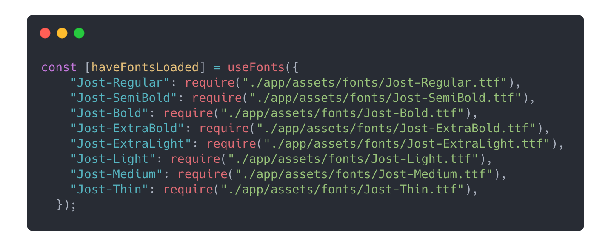
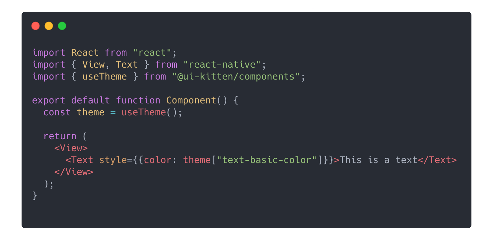
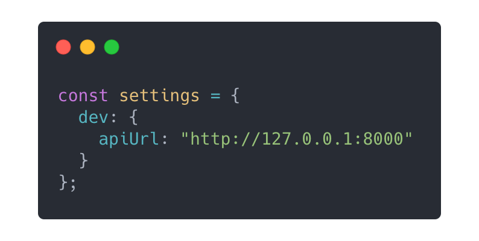
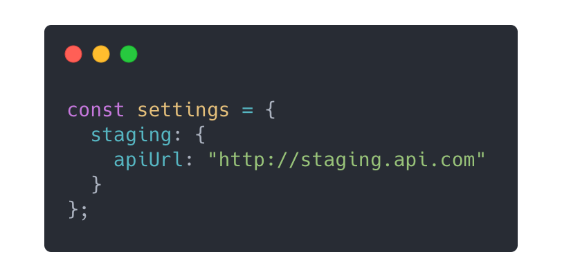
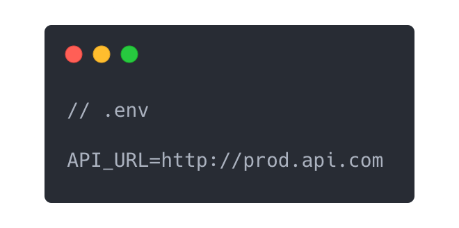
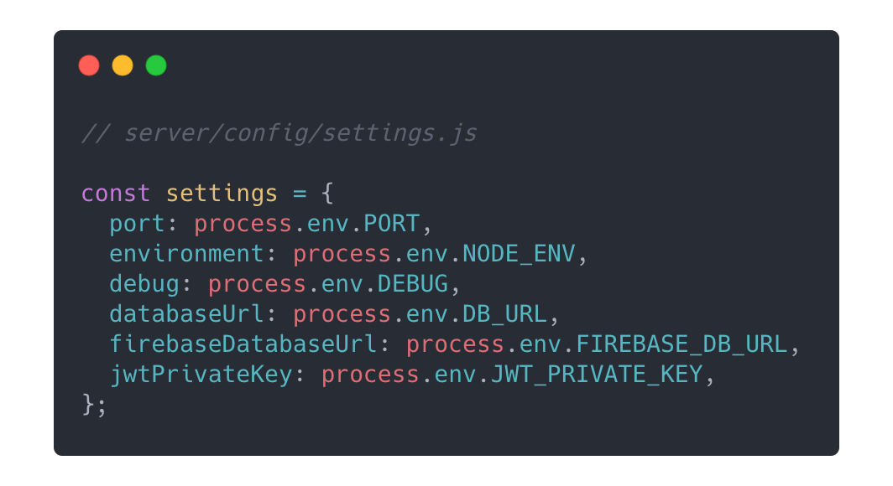
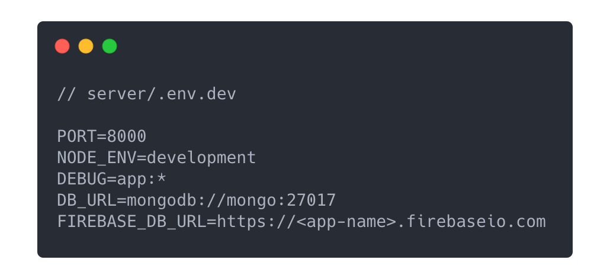
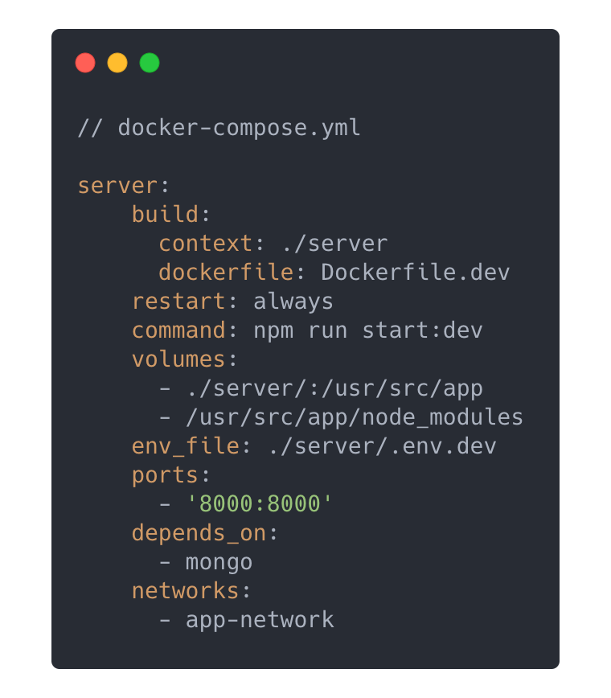
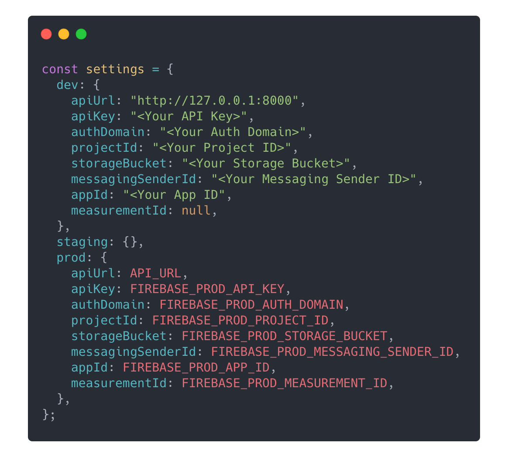

<p float="left">


</p>

`expo-essentials` is a kickass template built on top of [Expo](https://docs.expo.io/), containing a manageable folder structure, test suites, and essential features to get you up and running on your next app.

<p float="left">


</p>

# Table of Contents

1. [Key features](#key-features)
2. [Usage](#usage)
   1. [Installation](#installation)
   2. [Commands](#commands)
      1. [App commands](#app-commands)
      2. [Server commands](#server-commands)
   3. [Setting the theme](#setting-the-theme)
      1. [Choosing a color palette](#choosing-a-color-palette)
      2. [Choosing a font](#choosing-a-font)
      3. [Light and Dark theme configuration](#light-and-dark-theme-configuration)
      4. [Use theme colors in components](#use-theme-colors-in-components)
   4. [Settings for different environments](#settings-for-different-environments)
      1. [App configuration](#app-configuration)
         1. [Development configuration](#development-configuration)
         2. [Staging configuration](#staging-configuration)
         3. [Production configuration](#production-configuration)
      2. [Server configuration](#server-configuration)
   5. [Firebase Integration](#firebase-integration)
      1. [Adding your Firebase credentials to the app](#adding-your-firebase-credentials-to-the-app)
      2. [Adding your Firebase credentials to the server](#adding-your-firebase-credentials-to-the-server)
3. [Screens](#screens)
   1. [Welcome](#welcome-screen)
   2. [Onboarding](#onboarding-screen)
   3. [Authentication](#authentication-screen)
   4. [Home](#home-screen)
4. [How to Contribute](#how-to-contribute)

# Key features

- 📱 All Expo features (Hot reloading, Cross-platform, Splash screen, etc)
- 🎨 Easy theme configuration (Color palette and fonts)
- 💐 ESLint and Prettier formatting to promote cleaner code
- 🌗 Light and Dark mode
- 🔥 Firebase integration
- 🙏🏻 Welcome screen on first launch
- ❓ Swiper for onboarding to highlight features
- 🔒 User authentication using [Firebase](firebase.google.com), and persistent user login across multiple launches
- ↪ Navigation setup based on [React Navigation](https://reactnavigation.org/docs/getting-started/)
- 🔔 Toast notifications
- 📵 Network disconnect banner
- 📡 Offline support through caching network requests and images
- 🌎 Environment configuration based on app stage (develop, staging, and production)
- 📋 Easy forms with input validation based on [Formik](https://formik.org/) and [Yup](https://github.com/jquense/yup)
- ⚙️ (Optional) ExpressJS server and MongoDB database configured with a firebase auth middleware, environment setup, unit tests, and integration tests
- 📦 Flexibly written general components (Button, TextInput, Cards, Modal, Spinner, etc.)

_(...and many more coming soon!)_

# Usage

## Installation

1. Clone/Fork this repo (based on your preference)
2. Start the mobile app
   ```
   $ cd client
   $ npm start
   ```
3. (Optional) Start the ExpressJS server and MongoDB instance (You need to have [Docker](https://docs.docker.com/get-started/) installed)
   ```
   $ docker-compose up --build
   ```

## Commands

### App commands

| Command                   | Description                                                                                   |
| ------------------------- | --------------------------------------------------------------------------------------------- |
| `npm start`               | Start Expo metro server                                                                       |
| `npm run android`         | Starts the app in an android emulator                                                         |
| `npm run ios`             | Starts the app in an iOS emulator                                                             |
| `npm run web`             | Starts the app in the web browser                                                             |
| `npm run test`            | Active development of tests, watch files for changes and re-runs all tests                    |
| `npm run testDebug`       | Debug, console.logs and only re-runs the file that was changed                                |
| `npm run testFinal`       | Displays code coverage in cli and updates the code coverage html                              |
| `npm run updateSnapshots` | When a screen/component is updated, the test snapshots will throw an error, this updates them |
| `npm run eject`           | Eject the Expo app to native android and ios projects (Caution: This action is irreversible)  |

### Server commands

| Command                 | Description                                                                           |
| ----------------------- | ------------------------------------------------------------------------------------- |
| `npm run start:dev`     | Starts the server with the development configuration, restarts server on file changes |
| `npm run start:staging` | Starts the server with the staging configuration                                      |
| `npm run start:prod`    | Starts the server with the production configuration                                   |
| `npm run test:watch`    | Active development of tests, watch files for changes and re-runs tests                |
| `npm run test`          | Displays code coverage in cli and updates the code coverage html                      |

## Setting the theme

This template uses [UI Kitten](https://akveo.github.io/react-native-ui-kitten/) for controlling the theme. To read more about it, be sure to visit their [docs](https://akveo.github.io/react-native-ui-kitten/docs/guides/branding#branding).

### Choosing a color palette

- Use the [EVA Design System](https://colors.eva.design/) tool to create a palette based on your brand color.
- Export the palette as JSON and store the values in `client/app/config/colors.js`

### Choosing a font

- Store your desired font files (`.ttf` or `.otf` are preferred) in the `client/app/assets/fonts` folder. (By default, this template uses the [Jost](https://fonts.google.com/specimen/Jost) font).
- Update the font names and paths in `client/App.js`:
  

### Light and Dark theme configuration

You can specify different colors to be used for _light mode_ and _dark mode_ by updating the values in `client/app/config/lightTheme.js` and `client/app/config/darkTheme.js` respectively.

### Use theme colors in components

_(This method uses React hooks, so make sure you work with functional React components)_



## Settings for different environments

This template supports seamlessly changing configurations for your app based different environment builds (eg. _development_, _staging_ and _production_)

### App configuration

Settings for the mobile app is set in `client/app/config/settings.js`.

#### Development configuration

The development configuration should be set in the `dev` object directly.



#### Staging configuration

The staging configuration should be set in the `staging` object. You can either set them directly, or you can add them through the `client/.env` dot file (If you have sensitive data).



#### Production configuration

The production configuration should be set in the `prod` object, and should preferably be added through the `client/.env` file.

<p float="left">


</p>

### Server configuration

Settings for the server is set in `server/config/settings.js`. The ExpressJS server runs in a [Docker](https://www.docker.com/) container, so you can specify which environment file gets plugged into the container.



For instance, a development environment configuration can be set as:

- Create a `server/.env.dev` file:



- Specify using this environment file in the `docker-compose.yml` file:



## Firebase Integration

This template uses [Firebase](https://firebase.google.com/) for user authentication and management. Firebase offers a rich list of external providers that you would want to add in your app later on. They also handle sending emails for _email verification_, _password reset_ and _email change_.

It is suggested that you create 3 separate firebase projects for your app: `app-dev`, `app-staging`, and `app-prod` (For each environment that your app uses). This is to ensure that you can test your environemnts independent of each other, and prevent overlapping data.

### Adding your Firebase credentials to the app

Create **WebApp** configurations in your firebase projects, and add them in the appropriate environment objects.


### Adding your Firebase credentials to the server

The server uses the [Firebase Admin SDK](https://firebase.google.com/docs/admin/setup) to do create an authentication middleware. This middleware decodes the _JWT token_ sent from the app through an API request to identify users and their roles.

- Download your service account credentials from Firebase and save them in `server/config/firebase-service-account-<environment>.json`
  <br />(`server/config/firebase-service-account-dev.json`, `server/config/firebase-service-account-staging.json`, `server/config/firebase-service-account-prod.json`)

# Screens

## Welcome Screen

<p float="left">


</p>

## Onboarding Screen

<p float="left">


</p>

<p float="left">


</p>
    
## Authentication Screen

<p float="left">


</p>

<p float="left">


</p>

## Home Screen

<p float="left">


</p>

<p float="left">


</p>

# How to Contribute

1. Fork the repository
2. Add a bug fix or new feature addition and create a pull request to this repo
3. Write a detailed list of changes proposed in the pull request description
