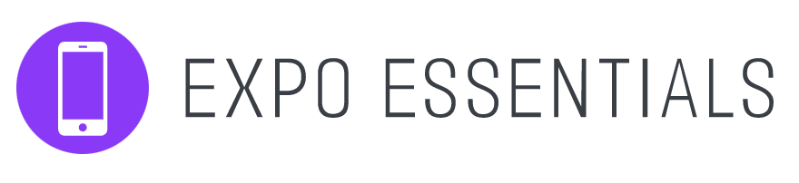

<p float="left">


</p>

`expo-essentials` is a kickass template built on top of [Expo](https://docs.expo.io/), containing a manageable folder structure, test suites, and essential features to get you up and running on your next app.

<p float="left">


</p>

# Table of Contents

1. [Key features](#key-features)
2. [Usage](#usage)
   1. [Installation](#installation)
   2. [Setting a theme](#setting-a-theme)
3. [Screens](#screens)
   1. [Welcome](#welcome-screen)
   2. [Onboarding](#onboarding-screen)
   3. [Authentication](#authentication-screen)
   4. [Home](#home-screen)
4. [How to Contribute](#how-to-contribute)

# Key features

- 📱 All Expo features (Hot reloading, Cross-platform, Splash screen, etc)
- 🎨 Easy theme configuration (Color palette and fonts)
- 💐 ESLint and Prettier formatting to promote cleaner code
- 🌗 Light and Dark mode
- 🔥 Firebase integration
- 🙏🏻 Welcome screen on first launch
- ❓ Swiper for onboarding to highlight features
- 🔒 User authentication using [Firebase](firebase.google.com), and persistent user login across multiple launches
- ↪ Navigation setup based on [React Navigation](https://reactnavigation.org/docs/getting-started/)
- 🔔 Toast notifications
- 📵 Network disconnect banner
- 📡 Offline support through caching network requests and images
- 🌎 Environment configuration based on app stage (develop, staging, and production)
- 📋 Easy forms with input validation based on [Formik](https://formik.org/) and [Yup](https://github.com/jquense/yup)
- ⚙️ (Optional) ExpressJS server and MongoDB database configured with a firebase auth middleware, environment setup, unit tests, and integration tests
- 📦 Flexibly written general components (Button, TextInput, Cards, Modal, Spinner, etc.)

_(...and many more coming soon!)_

# Usage

## Installation

1. Clone/Fork this repo (based on your preference)
2. Start the mobile app
   ```
   $ cd client
   $ npm start
   ```
3. (Optional) Start the ExpressJS server and MongoDB instance (You need to have [Docker](https://docs.docker.com/get-started/) installed)
   ```
   $ docker-compose up --build
   ```

## Setting a theme

(WIP)

# Screens

## Welcome Screen

<p float="left">


</p>

## Onboarding Screen

<p float="left">


</p>

<p float="left">


</p>
    
## Authentication Screen

<p float="left">


</p>

<p float="left">


</p>

## Home Screen

<p float="left">


</p>

<p float="left">


</p>

# How to Contribute

1. Fork the repository
2. Add a bug fix or new feature addition and create a pull request to this repo
3. Write a detailed list of changes proposed in the pull request description
